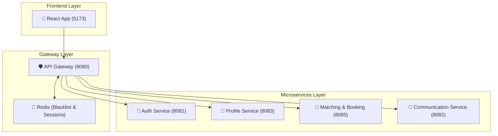

# 🩺 CareCircle-Pro: Elite Microservices Caregiving Platform

CareCircle-Pro is a high-fidelity, real-time ecosystem connecting parents with specialized caregivers. Built on a modern distributed architecture, it ensures safety, scalability, and seamless communication.

## 🏗️ System Architecture

The system follows a **Domain-Driven Design (DDD)** split across core microservices, orchestrated by a secure API Gateway and backed by Redis for high-performance session management.



## 🚀 Getting Started

### 1. Prerequisites
- [Docker & Docker Compose](https://www.docker.com/get-started)
- [Java 17+](https://adoptium.net/)
- [Node.js 18+](https://nodejs.org/)
- [Maven](https://maven.apache.org/)

### 2. Environment Configuration
The application uses environment variables for secure configuration.

1. Copy the `.env.example` file to create your own `.env` file:
   ```bash
   cp .env.example .env
   ```
2. Open `.env` and fill in your actual credentials (database passwords, mail server secrets, JWT keys).

> [!IMPORTANT]
> Never commit your `.env` file to version control. It is already included in `.gitignore`.

### 3. Launch with Docker
The easiest way to run the entire stack is using Docker Compose:
```bash
docker-compose up --build
```
This starts MySQL, Redis, all Microservices, and the Frontend.

## 🗺️ Port Map & Entry Points

| Service | Port | Database | Primary Responsibility |
| :--- | :--- | :--- | :--- |
| **API Gateway** | `8080` | N/A | Routing, JWT Validation, Rate Limiting |
| **Auth Service** | `8081` | `carecircle_auth` | User Identity, Tokens, OTP |
| **Comm Service** | `8082` | `carecircle_comm` | WebSockets, STOMP Messaging |
| **Profile Service**| `8083` | `carecircle_profile`| Parent/Caregiver Metadata |
| **Booking Service**| `8085` | `carecircle_booking`| Matching, Overlap Checks |
| **Frontend UI** | `5173` | N/A | React (Vite) User Interface |

## 🛠️ Development
If you want to run services individually, navigate to the specific service directory and use:
```bash
mvn spring-boot:run  # For Java services
npm run dev         # For the Frontend
```

## 📚 Elite Study Manuals
- **[Master Visual Guide](./master_visual_guide.html)**: Interactive diagrams and feature flows.
- **[Comprehensive Interview Guide](./comprehensive_project_guide.md)**: 150+ Technical Q&As.

---
*Built with professional integrity by CareCircle-Pro Team.*
