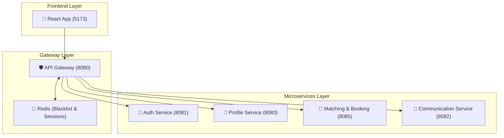

# 🩺 CareCircle-Pro: Elite Microservices Caregiving Platform

CareCircle-Pro is a high-fidelity, real-time ecosystem connecting parents with specialized caregivers. Built on a modern distributed architecture, it ensures safety, scalability, and seamless communication.

## 🏗️ System Architecture

The system follows a **Domain-Driven Design (DDD)** split across four core microservices, orchestrated by a secure API Gateway and backed by Redis for high-performance session management.



## 🚀 Quick Start (Local Development)

### 1. Prerequisites
- Java 17+
- Node.js 18+
- MySQL 8.x
- Redis 7.x

### 2. Launch Infrastructure
Navigate to the root and run:
```bash
docker-compose up -d
```
*This starts MySQL and Redis containers required for all services.*

### 3. Start Microservices
Run each service in its respective folder:
```bash
mvn spring-boot:run
```

## 🗺️ Port Map & Entry Points

| Service | Port | Database | Primary Responsibility |
| :--- | :--- | :--- | :--- |
| **API Gateway** | `8080` | N/A | Routing, JWT Validation, Rate Limiting |
| **Auth Service** | `8081` | `carecircle_auth` | User Identity, Tokens, OTP |
| **Comm Service** | `8082` | `carecircle_comm` | WebSockets, STOMP Messaging |
| **Profile Service**| `8083` | `carecircle_profile`| Parent/Caregiver Metadata |
| **Booking Service**| `8085` | `carecircle_booking`| Matching, Overlap Checks |
| **Frontend UI** | `5173` | N/A | React (Vite) User Interface |

## 📚 Elite Study Manuals
- **[Master Visual Guide](./master_visual_guide.html)**: Interactive diagrams and feature flows.
- **[Comprehensive Interview Guide](./comprehensive_project_guide.md)**: 150+ Technical Q&As.

---
*Built with professional integrity by CareCircle-Pro Team.*
